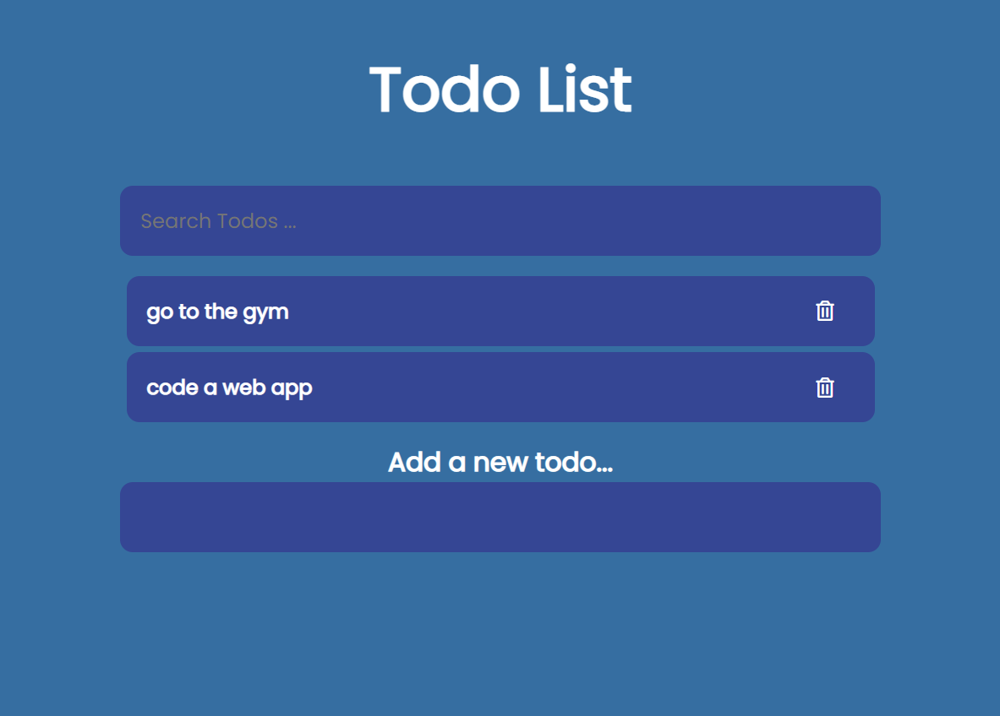

# simple-todo-app
It is a typical To-do app where a user can input future to-do's and remove them when completed

### front-end
The UI is built with html and css
I've used font awesome to get some logos

### back-end
Firebase is used as the backend  
Firebase is a backend-as-a-service, so you can configure it for your app as needed  
I've used its cloud database (firestore) to store the ToDo's of the app

